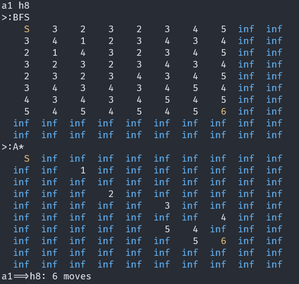

### 《算法分析与设计》课程实验

- EXP1：棋盘覆盖
- EXP2：矩阵连乘
- EXP3：最长公共子序列
- EXP4：哈夫曼编码
- EXP5：Dijkstra
- EXP6：跳马问题
- EXP7：装载问题

棋盘覆盖可视化

> 采用FLUTTER框架实现

> cd web_qpfg\build\web
>
> python -m http.server 8000
>
> http://127.0.0.1:8000/

跳马问题BFS&Astar对比

